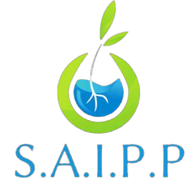

<h1 align="center">SAIPP - Sistema Autossustentavel de Irrigação para Pequenos Produtores</h1>

### Funcionalidades

- [x] Cadastro de usuário. 
- [x] Sistema de Layout que atualiza suas cores conforme o padrão do dispositivo do usuário. 
- [x] Controle de Umidade do solo.
- [x] Acionamento de um Sistema de irrigação de forma remota.
- [x] Acionamento por comando de voz com utilização do Google Assistente.
- [x] Automação do acionamento do sistema pelo nível de umidade do solo. ( Programado limite mínimo e máximo pelo usuário )
- [x] Consumo de API (previsão do tempo e consulta de CEP).  

## 📱 Mobile 

 
  
  
  
  
  
  

  
  
  
  
  
  

## 🛠 Tecnologias utilizadas

As seguintes ferramentas foram usadas na construção do projeto:

- 
- 
- 
- 

## 🏆 Premiações conquistadas com o projeto 

- Primeiro lugar na feira de inovação técnologica (FEINTEC) 2022.
- Segundo lugar VII FIMUCTI - Feira de Ciência, Tecnologia e Inovação do Vale do Café 2022. (Rio de Janeiro)

## 📄 Licença

Esse projeto está sob a licença (nome da licença) - acesse os detalhes [LICENSE.md](https://github.com/link_da_licenca).

